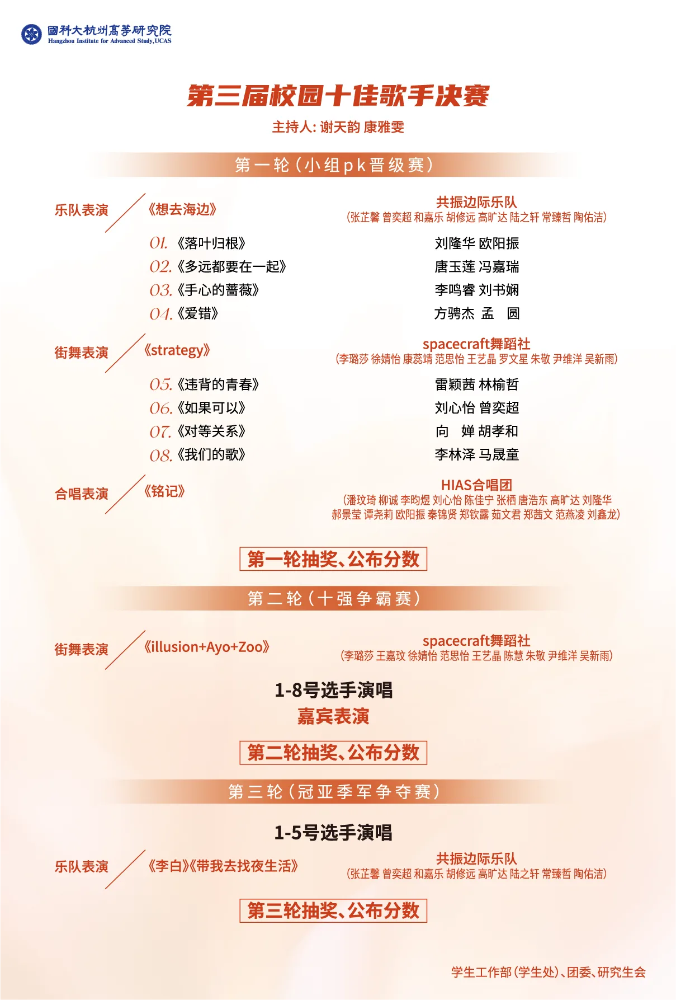
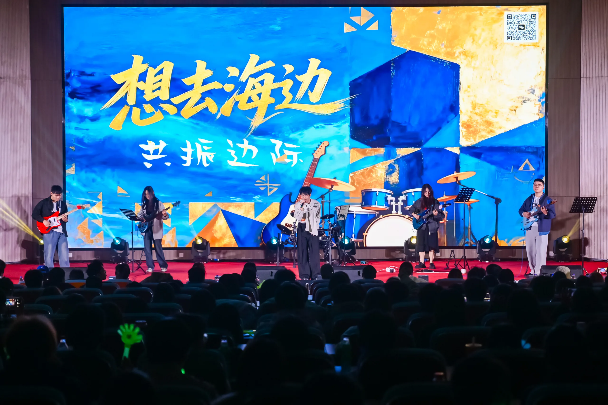
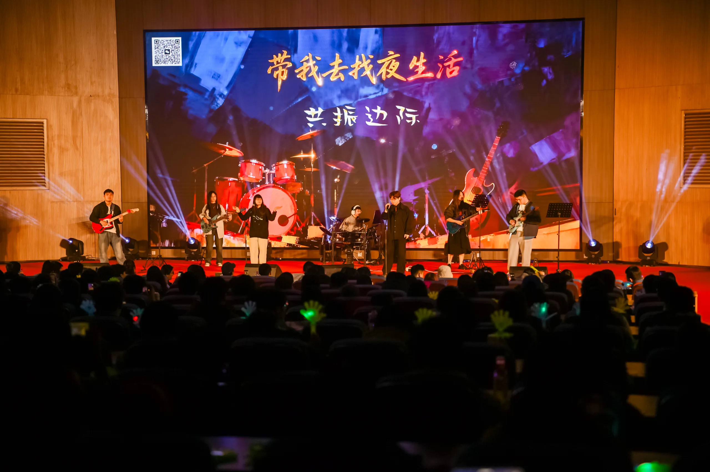
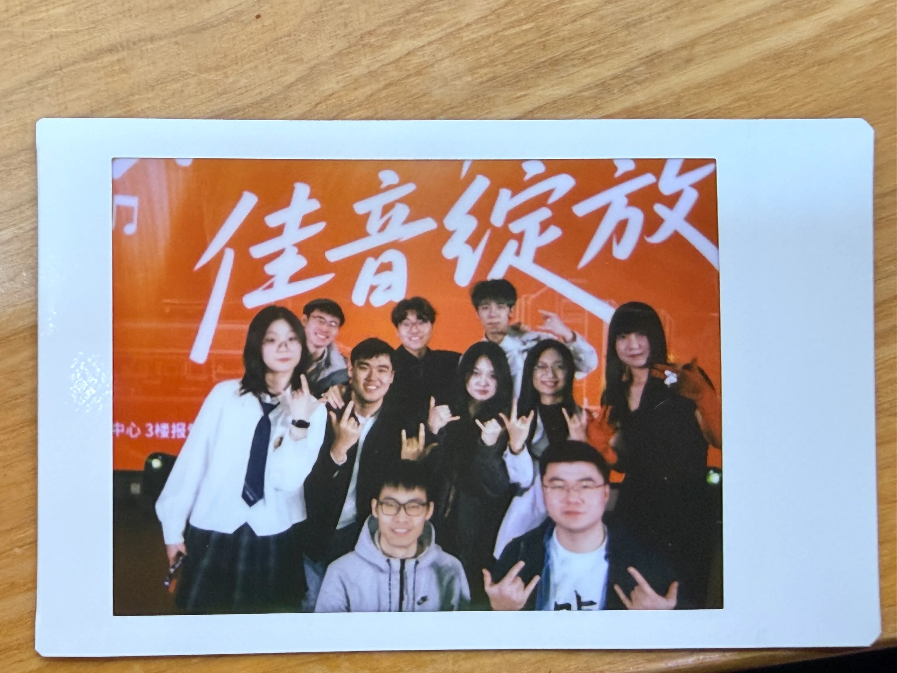
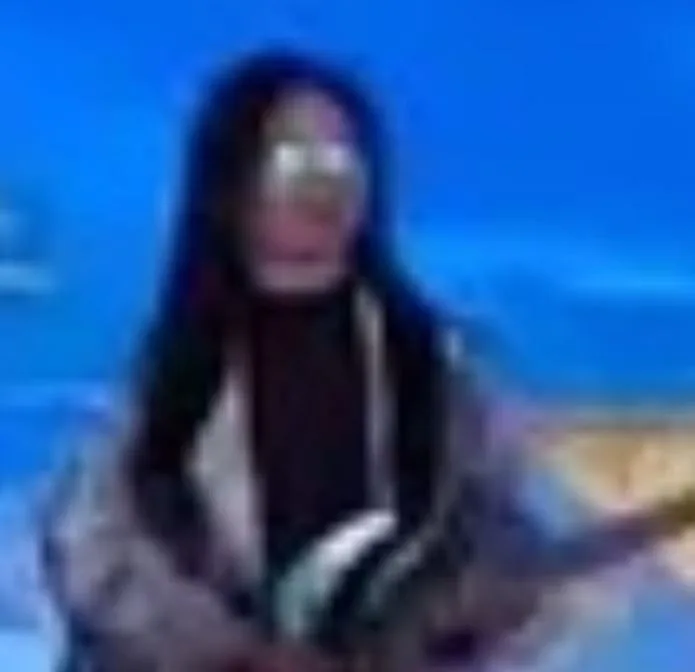

第三届校园十佳歌手大赛决赛于 2026 年 1 月 8 日（周四）18:00，在国科大杭高院云艺院区 6 号楼文体中心三楼报告厅举办。

对共振边际来说，这是真正意义上的第一次演出——之前所有的排练、摸鱼和互相吐槽，都是为了这一晚。

## 节目单

## 演出现场

我们在决赛现场带来了两首曲目：《想去海边》与《带我去找夜生活》。

## 合照

还有一张不知道被谁抓拍到的神秘照片，就放在这里，不作解释。

## 演出之后

散场之后我们去吃了地锅鸡。

有两个重大发现：一是团队里存在大量粥 p；二是存在以三六为首的神秘第五人格团伙。

至此，乐队的第一次演出圆满结束，第一批黑料也同步归档。
