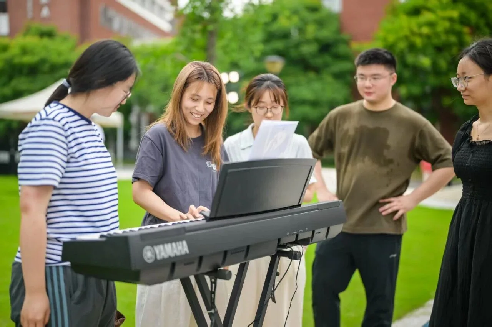
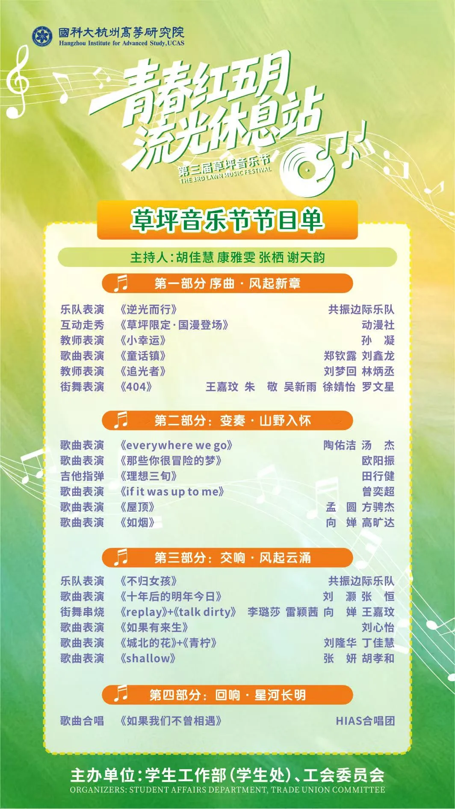
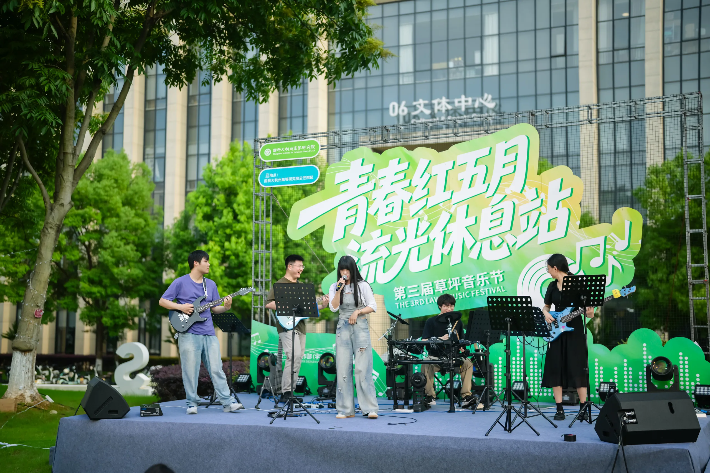
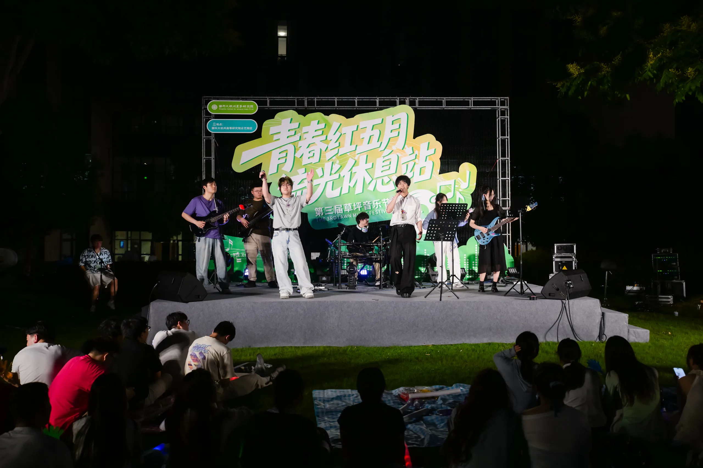
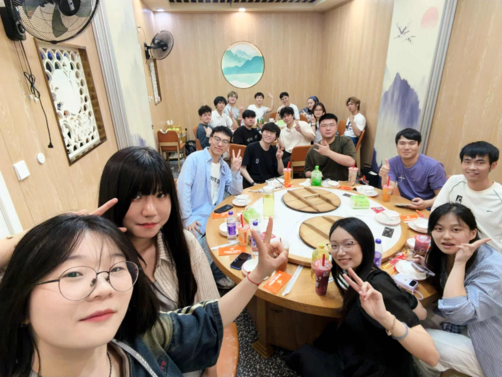

第三届草坪音乐节于 2026 年 5 月 27 日（周三）在国科大杭高院云艺院区举办。下午是集市，晚上是音乐节。

## 下午：草坪集市

14:30 到 17:00 是草坪集市时间。器乐社出动了几位选手参与其中，顺便也把社团宣传了一波。

## 晚上：音乐节

18:00 起，音乐节正式开启。

### 《逆光而行》（其实是《闪闪发光的灰》）

共振边际乐队率先登场。

> 强劲的鼓点与激昂的吉他瞬间点燃全场氛围。

以上是 HIAS 青年官方的宣传文案。实际情况是这样的：

> [!NOTE]
> 终于没有人提杭州高等研究院器乐社共振边际乐队在 2026 年 5 月 27 日下午在《闪闪发光的灰》3:30 处开始超速 1.5 倍的事情了。

从图里能看出来，台上的乐手也是难以蚌住，各个喜笑颜开。众宾欢也，齐齐哈尔。

### 《不归女孩》

第三篇章，共振边际乐队再次登台，带来《不归女孩》。

这一集最大的看点在台上的三六 😂😂😂 曲目进行到一半，她的背带脱落了。

只见其迅速尝试脚踩铺架，数次未果后，果断改用虚空提腿的方式驯服了自己的琴。操作之精湛，可见一斑。

## 落幕

当最后一个音符消散在晚风里，当草坪上的灯光缓缓熄灭，草坪音乐节暨草地集市圆满落下帷幕。

在白昼的烟火气与夜晚的浪漫旋律中，我们共同书写了一段关于青春、热爱与温暖的难忘回忆。从下午的草地集市到晚上的音乐会，超过 300 名师生一起度过了这个夏日限定的日子。

## 演出之后

演出结束之后，我们又去吃了地锅鸡。

