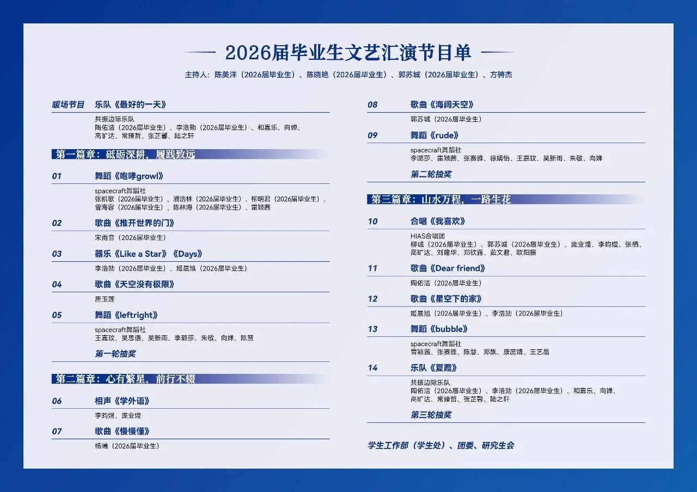
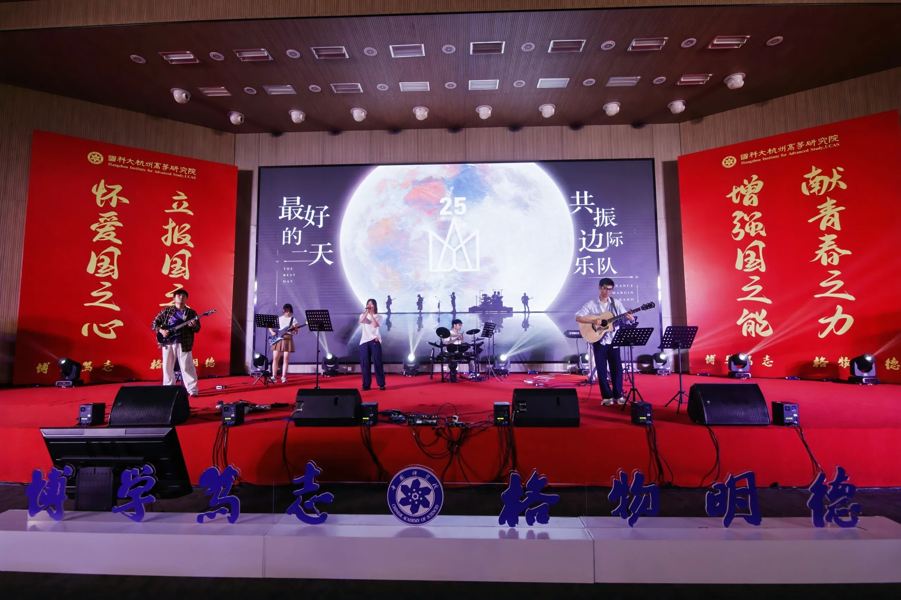
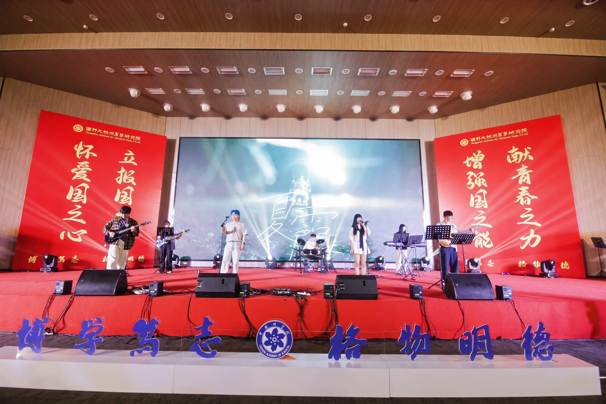
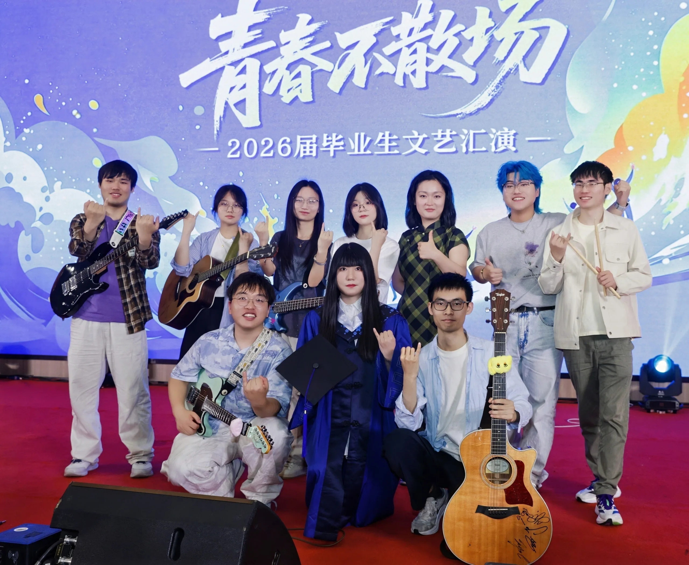
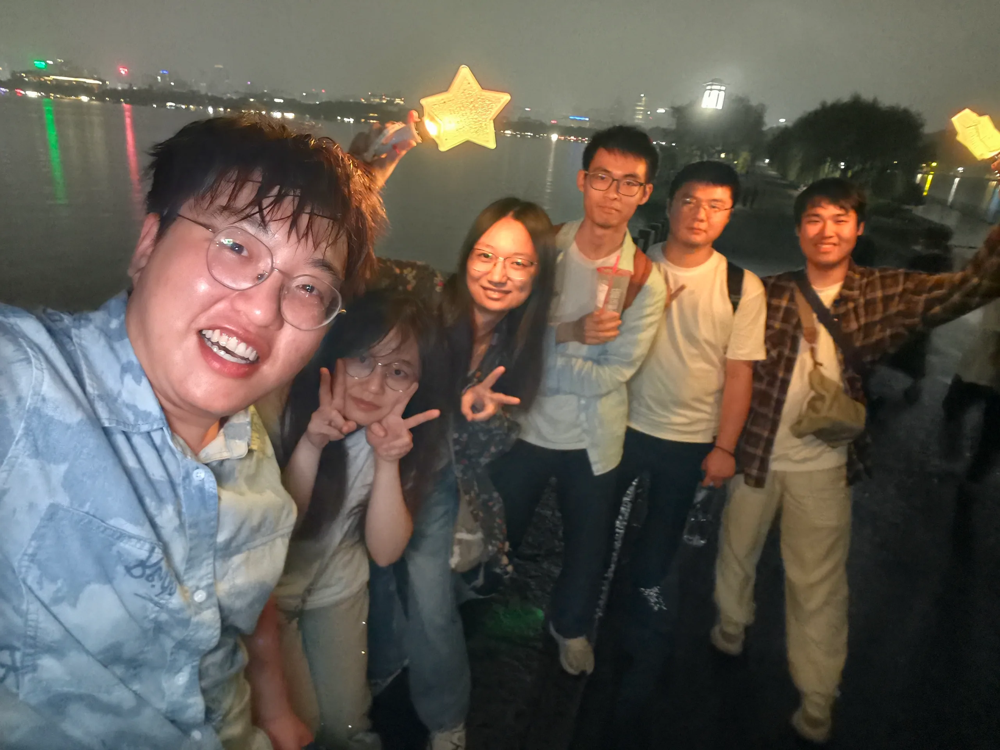

2026 届毕业生文艺汇演于 2026 年 6 月 23 日（周二）14:00，在国科大杭高院云艺院区 6 号楼文体中心 3 楼报告厅举办。

大家用才艺展现对青春的无限热爱、对未来的美好憧憬，并向全体毕业生传递最诚挚的祝福。乐队里的三位成员，也即将毕业离去。

## 节目单

## 《最好的一天》

共振边际乐队以一首《最好的一天》开场。

姬哥现身说法，出手键盘，并辅以和声。虽然人均有所呲杆，但现场效果拔群。

## 《夏霞》

之后又用一首《夏霞》为毕业演出收尾。

衡兰芷若姗姗来迟，进行了一波零样本推理，成功验证了模型的鲁棒性。

## 合照

## 演出之后

结束后几个入去搓了一顿烤肉，又夜游了西湖。

之后通宵在 KTV 进行了一波毕业临行前的告别。其间有神入在狂唱不止，有神入在玩加页手记，还有神入在工作，可谓异彩纷呈。
